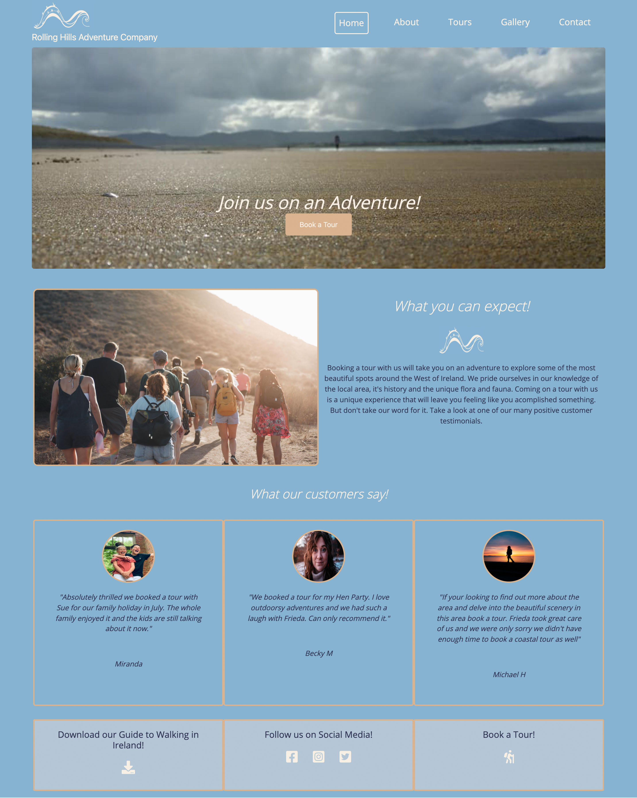

<h1 align="center">Rolling Hills Tour Company</h1>

Welcome to the Rolling Hills Adventure Company Website ReadMe file. We are a small tour company based in the West of Ireland. On our site you can find out more about us, the places we love and the tours you can book with us. The site is designed to be responsive and to tease you with beautiful scenery ready for you to explore with us.

[You can view the website here:](https://rollingsea.github.io/ms1-tour-company/about.html) 

<h2 align="center"></h2>

## User Experience UX

- ### First Time Visitor Goals

1. To easily understand the purpose of the site
2. To gain knowledge about the company and it's offering by easily navigating through the site
3. To see that other customers have been happy with their experience

- ### Returning Visitor Goals 

1. To learn a little more about the operator of the tour company
2. To take a look through a gallery
3. To take a look at the tours available, the time I need to commit, the pricing etc.
4. To be able to easily book my first tour.

- ### Frequent Visitor Goal

1. To be able to view and book a range of tours 
2. To easily get in touch with the company about booking a more tailored experience for a whole group
3. To sign up to their newsletter about new tours or special events happening

- ### Design
#### Color Scheme Used
Using a set of 4 colors to suit the outdoor nature theme of the company and highlight the images to their best advantage. 
#### Font
Using Open Sans with a fall back to sans serif throughout the site for a clean modern look.
#### Imagery
The bulk of the images are my own. The testimonial images and the group image on the index page were sourced from www.unsplash.com 
I designed a company logo in Photoshop to add branding to the navbar and be able to highlight the brand throughout the site. 

The website has been built using some bootstrap components starting with the navbar.

### Wireframes

Designed wire frames for the site initially. Some of the layout has changed as I worked on creating the site and adapted as I felt might work best for the user.

### [Home-page Wireframe](wireframes/home-page.png)
### [About-page Wireframe](wireframes/about-page.png)
### [Tour-page Wireframe](wireframes/tour-page.png)
### [Gallery-page Wireframe](wireframes/gallery-page.png)
### [Contact-page Wireframe](wireframes/contact-page.png)

## Features

- Responsive on all devices
- Slider Gallery

## Languages Used
 - HTML5
 - CSS3
 - Javascript   

## Frameworks and Libraries Used

-  [Bootstrap 4.6.x](https://getbootstrap.com/docs/4.6/getting-started/introduction/)
   - Bootstrap was used for the navigation bar, the slider gallery and to make the site more responsive.

- [Google Fonts](https://fonts.google.com/)
   - Google fonts was used to import the Open Sans Font into the style sheet and used throughout the site.

- [Hover.css](https://ianlunn.github.io/Hover/)

- [Font Awesome](https://fontawesome.com/)
  - Font Awesome was used to add the download, social and hiking icons to the site

- [Git](https://git-scm.com/)
    - Git was used for version control by utilizing the Gitpod terminal to commit to Git and Push to GitHub.
- [GitHub](https://github.com/)
    -  GitHub is used to store the projects code after being pushed from Git.
- [Photoshop:](https://www.adobe.com/ie/products/photoshop.html)
    - Photoshop was used to create the logo, resizing images and editing photos for the website.
- [Balsamiq:](https://balsamiq.com/)
    - Balsamiq was used to create the wireframes during the design process.

### Testing

Tested the site as I built each section using Chrome Developer Tools. Found this particularly helpful for picking up issues with responsiveness and layout and being able to edit style rules to see results is great. 
- Things I have checked:
   - All navbar links pointing to the correct pages and hover and active styling is working.
   - All buttons styled the same throughout and directing the user to the correct pages and files.
   - All Divs and images checked for responsiveness, making sure images aren't stretched and content does not overlap.
   - Image Slider checked for responsiveness and image quality. 
   - Contact Form and Tour Booking Forms checked for collecting data using the Code Institute https://formdump.codeinstitute.net/ for testing. Later removed this to allow for better user experience by directing the user to a booking confirmation page and a Thanks for your message page. 

### Deployment to Github Pages

Opened ms1-tour-company repository in github. Clicked on settings, then clicked on pages and set to master and root. Saved and got a link. 

Found that my images were not working in the github pages link. Researched online for a solution. Found one but this then created a problem in gitpod with the images. Got in touch through the tutor pages and got hint to look at relative paths. Researched on this and went back to slack and between the two found that changing from // to / infront of the assets folder solved the issue. 

  